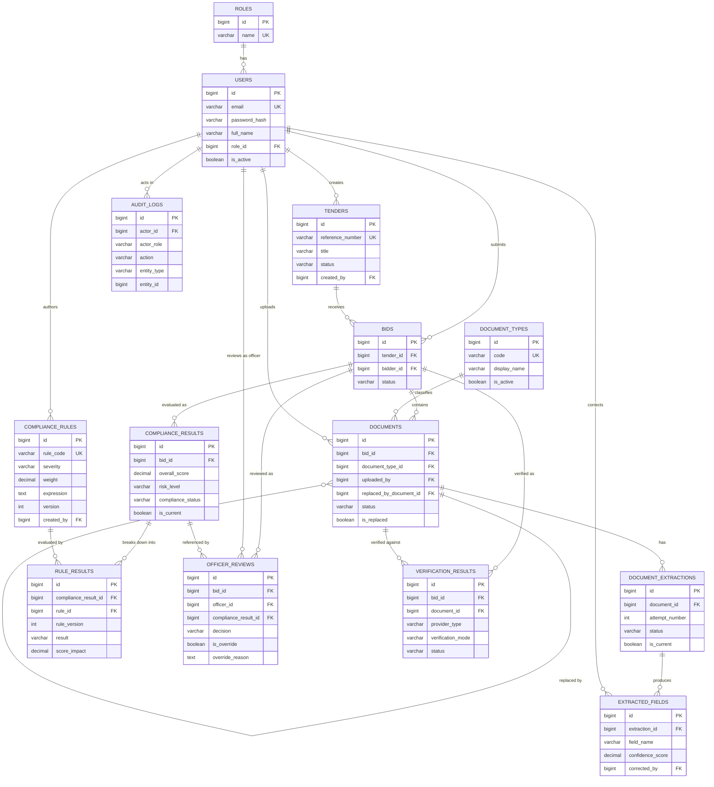

# PRAMAAN - Entity Relationship Diagram

Status: LOCKED (Day 2)

This diagram shows all 14 entities in the PRAMAAN schema and their
relationships. It renders directly on GitHub via Mermaid.

For full column definitions, types, constraints, indexes, and business
rules, see database-design.md in this same folder. This file focuses
on structure and relationships only.

---

## Mermaid ER Diagram

---

## Reading Notes

- `entity_type` / `entity_id` on AUDIT_LOGS are intentionally not a
  foreign key relationship (see database-design.md for rationale), so
  no direct edge is drawn from AUDIT_LOGS to every other entity here.
  Conceptually, AUDIT_LOGS can reference any entity in this diagram.
- The self-referencing DOCUMENTS -> DOCUMENTS edge represents the
  optional document-replacement link (replaced_by_document_id).
- is_current (on DOCUMENT_EXTRACTIONS and COMPLIANCE_RESULTS) and
  bids.status (the authoritative decision pointer) are business rules
  enforced at the application layer, not visible as diagram
  constraints - see database-design.md for the full explanation.
